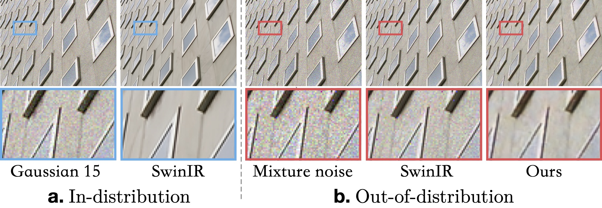

# Masked Image Training for Generalizable Deep Image Denoising

[Haoyu Chen](https://haoyuchen.com/), [Jinjin Gu](https://www.jasongt.com/), [Yihao Liu](https://scholar.google.com.hk/citations?user=WRIYcNwAAAAJ&hl=zh-CN&oi=ao), [Salma Abdel Magid](https://sites.google.com/view/salma-abdelmagid/), [Chao Dong](https://scholar.google.com.hk/citations?user=OSDCB0UAAAAJ&hl=zh-CN), Qiong Wang, [Hanspeter Pfister](https://scholar.google.com.hk/citations?hl=zh-CN&user=VWX-GMAAAAAJ), [Lei Zhu](https://sites.google.com/site/indexlzhu/home?authuser=0)


> Abstract: When capturing and storing images, devices inevitably introduce noise. Reducing this noise is a critical task called image denoising. Deep learning has become the de facto method for image denoising, especially with the emergence of Transformer-based models that have achieved notable state-of-the-art results on various image tasks. However, deep learning-based methods often suffer from a lack of generalization ability. For example, deep models trained on Gaussian noise may perform poorly when tested on other noise distributions. To address this issue, We present a novel approach to enhance the generalization performance of denoising networks, known as masked training. Our method involves masking random pixels of the input image and reconstructing the missing information during training. We also mask out the features in the self-attention layers to avoid the impact of training-testing inconsistency. Our approach exhibits better generalization ability than other deep learning models and is directly applicable to real- world scenarios. Additionally, our interpretability analysis demonstrates the superiority of our method.




## Masked Image Training

The transformer architecture of our proposed masked image training. We only make the minimal change to the original SwinIR architecture – the ***input mask*** operation and the ***attention masks***.


Clone repo
----------
```
git clone https://github.com/haoyuc/MaskedDenoising.git
```
```
pip install -r requirement.txt
```


> This code is built on [KAIR](https://github.com/cszn/KAIR). We thank the authors for sharing their codes. For more detailed code information, please refer to [KAIR](https://github.com/cszn/KAIR).


Training
----------

You should modify the json file from [options](https://github.com/haoyuc/MaskedDenoising/tree/master/options) first, for example,

- setting [`"gpu_ids": [0,1,2,3]`](https://github.com/haoyuc/MaskedDenoising/blob/8e372c2352e5dd81e2cbab0031f7f2cd0fbcb9c5/options/masked_denoising/input_80_90.json#L4C12-L4C12) if 4 GPUs are used,
- setting [`"dataroot_H": "trainsets/trainH"`](https://github.com/haoyuc/MaskedDenoising/blob/8e372c2352e5dd81e2cbab0031f7f2cd0fbcb9c5/options/masked_denoising/input_80_90.json#L20C30-L20C30) if path of the high quality dataset is `trainsets/trainH`, more images are better.
- **input mask**: setting [`"if_mask"`](https://github.com/haoyuc/MaskedDenoising/blob/8e372c2352e5dd81e2cbab0031f7f2cd0fbcb9c5/options/masked_denoising/input_80_90.json#L32C7-L32C7) and `"mask1"`, `"mask2"`(line 32-34), the making ratio will randomly sample between mask1 and mask2.
- **attention mask**: setting [`"use_mask"`](https://github.com/haoyuc/MaskedDenoising/blob/8e372c2352e5dd81e2cbab0031f7f2cd0fbcb9c5/options/masked_denoising/input_80_90.json#L68) and `"mask_ratio1"`, `"mask_ratio2"` (line 68-70). The attention mask ratio can be a range or a fixed value.


---

- Training with `DataParallel` - PSNR


```bash
python main_train_psnr.py --opt options/input_80_90.json
```


- Training with `DistributedDataParallel` - PSNR - 4 GPUs

```bash
python -m torch.distributed.launch --nproc_per_node=4 --master_port=1234 main_train_psnr.py --opt options/input_80_90.json  --dist True
```


- Kill distributed training processes of `main_train_psnr.py`

```bash
kill $(ps aux | grep main_train_psnr.py | grep -v grep | awk '{print $2}')
```

Testing
----------

```bash
python main_test_swinir.py \
        --model_path model_zoo/input_mask_80_90.pth  \
        --name input_mask_80_90/McM_poisson_20  \
        --opt model_zoo/input_mask_80_90.json \
        --folder_gt testset/McM/HR  \
        --folder_lq testset/McM/McM_poisson_20
```


trainsets
----------
You can use more images for better porformance.    
- [DIV2K](https://data.vision.ee.ethz.ch/cvl/DIV2K/)   
- [Flickr2K](https://cv.snu.ac.kr/research/EDSR/Flickr2K.tar)   
- BSD500   
- WED   


testsets
-----------
- [cbsd68](https://github.com/cszn/FFDNet/tree/master/testsets)
- [kodak24](https://github.com/cszn/FFDNet/tree/master/testsets)
- urban100
- McMaster


References
----------
```BibTex
@InProceedings{Chen_2023_CVPR,
    author    = {Chen, Haoyu and Gu, Jinjin and Liu, Yihao and Magid, Salma Abdel and Dong, Chao and Wang, Qiong and Pfister, Hanspeter and Zhu, Lei},
    title     = {Masked Image Training for Generalizable Deep Image Denoising},
    booktitle = {Proceedings of the IEEE/CVF Conference on Computer Vision and Pattern Recognition (CVPR)},
    month     = {June},
    year      = {2023},
    pages     = {1692-1703}
}
```
